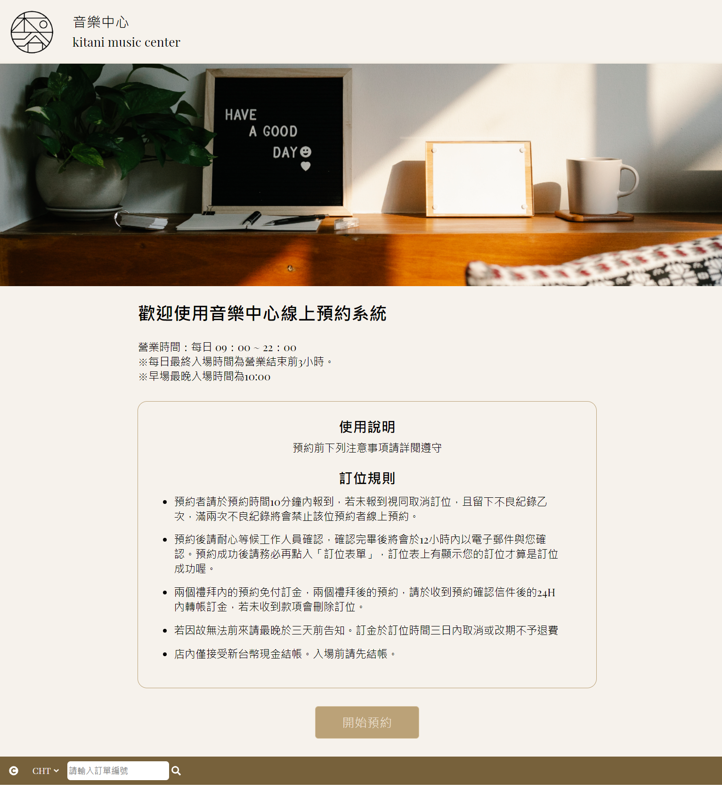
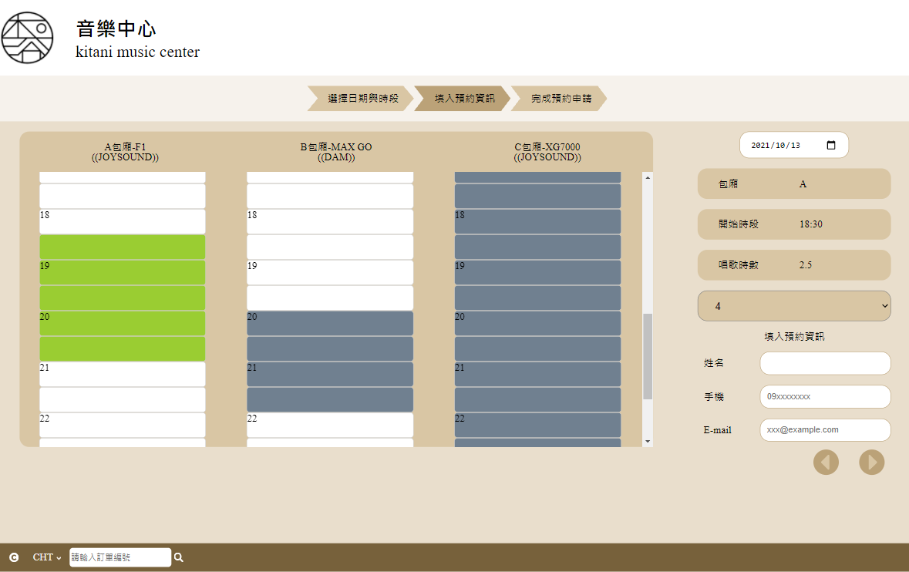
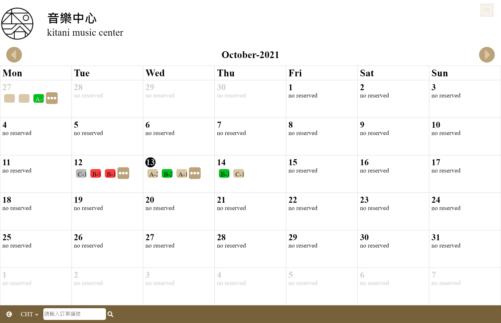
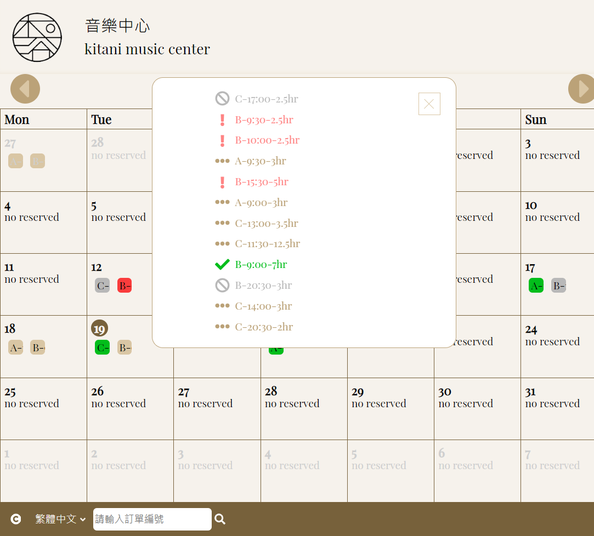

# Reserve Your Singing Day

Provide an interactive interface (bilingual) for customers and merchants to exchange the reservation information.

<table>
  <tr>
    <td>
    For Customer
    </td>
    <td>
    Customers can view the current availability of reservations and proceed with the reservation process. After completion, they will receive an order number and can check the current status of their orders through the website.
     
    
    
  </td>
  </tr>
  <tr>
    <td>
    For Merchant
    </td>
    <td>
    In addition to the features that customers can use, merchants can also use the calendar to manage all current orders and adjust the order content.
     
    
    
    </td>
  </tr>
</table>

<!-- 提供顧客與商家訂位資訊交流的互動介面（中英雙語系）。
顧客可以查看目前可訂位資訊，並進行訂位的手續，完成後會取得訂單編號，可以透過網頁查詢訂單目前的處理狀況。
商家除了顧客能使用的功能以外，還可以使用日曆的型態管理目前所有訂單，和調整訂單內容。 -->

  <b>
    <table>
      <tr>
        <td>Demo(customer)</td>
        <td>http://3.15.89.71:3100</td>
        <td></td>
      </tr>
      <tr>
        <td>Demo(merchant)</td>
        <td>http://3.15.89.71:3100/memberSystem</td>
        <td>
          <b>Test Account (merchant)</b>
          <ul style="padding-left:1.2rem;">
            <li>Email: test1@gmail.com</li>
            <li>Password: test10000</li>
          </ul>
        </td>
      </tr> 
    </table>
  </b>

# Table of Contents

- [React Source Code](#react-source-code)
- [Used Skills](#used-skills)
- [Features Introduction](#Features)

  - [common](#common-feature)
    

feature
<blockquote>
        a. Multi-language interface switching
    </blockquote>

  - [customer side](#customer-side-features)
    

 features
<blockquote>

    1. Reservation Process
    2. Order Enquiry Process

    

c. Select Appointment Time (Introduce the click mode)

    <blockquote>

    1. Freedom to choose different packages
    2. Don't have to cancel the original selection to reselect the time
    3. Prevent backward selection
    4. Double-click to deselect
    5. The selection is invalid when the selected area crosses the booked period

    </blockquote>

    4.  Modify Appointment Information
    5.  Check Order Status
    </blockquote>

  - [merchant side](#merchant-side-features)
    

features
<blockquote>

    1. Merchant Login
    2. View All Orders Status In The CMS

    

c. Modify Order Status

    <blockquote>

    1. Change order status from "Applied" to "Confirmed"
    2. If the order status is "Conflicted", it is forbidden to change it to the confirmed status

    

c. If the order status is "Applied"
<blockquote>

    1. Change order status from "Applied" to "Confirmed"
    2. "Reserved" button and "Confirmed" button are not allowed to be clicked

    </blockquote>

    4. Change order status from "Confirmed" to "Cancelled"
    5. Cancelled orders cannot be modified.
    6. The schedule and the calendar will be updated simultaneously according to the selected date
    7. Order status of past time cannot be modified

    </blockquote>

       
    4. Merchant Logout

    </blockquote>

    

# <a name="react-source-code">React Source Code</a>

[react source code (github repository)](https://github.com/mshmwr/reservation-system)

# <a name="used-skills">Used Skills</a>

| skill             | description                                               |
| ----------------- | --------------------------------------------------------- |
| React ( hook )    | SPA, reusable functional components, custom hooks         |
| React Router      | SPA, public and private route set up                      |
| Redux             | centralize the application's state                        |
| styled-components | CSS-In-JS library for styling                             |
| BEM methodology   | help creating reusable and modular components             |
| React-i18next kit | an internationalization-framework to localize the website |
| Prettier          | keep coding style consistent and better formatted         |
| Reset.css         | reduce browser inconsistencies in things in development   |
| webpack           | bundle JavaScript files and resources for usage           |
| Node.js           | Hosting for Back-End                                      |

# <a name="Features">Features Introduction</a>

## <a name="common-feature">Features (common)</a>

- [Multi-language interface switching](#Multi-language-interface-switching)

### <a name="Multi-language-interface-switching"> :star: Multi-language Interface Switching</a>

  <!--04-customer-reservation(multiLang) -->

https://user-images.githubusercontent.com/66200737/137618091-cc474b67-2d1c-46bb-9284-beaef2488be8.mp4

## <a name="customer-side-features"> Features (customer side)</a>

- [Reservation Process](#Reservation-Process)
- [Order Enquiry Process](#Order-Enquiry-Process)
- [Select Appointment Time](#Select-Appointment-Time)
- [Modify Appointment Information](#Modify-Appointment-Information)
- [Check Order Status](#Check-Order-Status)

### <a name="Reservation-Process"> :star: Reservation Process </a>

  <!-- 01-customer-reservation -->

https://user-images.githubusercontent.com/66200737/137618098-3378fab4-dceb-49bd-8116-a8297cdd42e0.mp4

### <a name="Order-Enquiry-Process"> :star: Order Enquiry Process </a>

  <!-- 02-order-enquiry -->

https://user-images.githubusercontent.com/66200737/137618103-b28101e8-c6d7-490e-9a88-5908d19ef79b.mp4

### <a name="Select-Appointment-Time"> :star: Select Appointment Time </a>

(Introduce the click mode)

1. Freedom to choose different packages
2. Don't have to cancel the original selection to reselect the time
3. Prevent backward selection
4. Double-click to deselect
5. The selection is invalid when the selected area crosses the booked period

---

1. Freedom to choose different rooms
<!-- 05-1-time-selection_normal -->

https://user-images.githubusercontent.com/66200737/137618108-77681547-68e3-4500-b7ea-a966f040ac39.mp4

2. Don't have to cancel the original selection when selecting another time
<!-- 05-2-time-selection_cross-timeline(1.5x) -->

https://user-images.githubusercontent.com/66200737/137618114-8b1d86b4-bb8d-4a85-9aab-6c0c04d63aa4.mp4

3. Prevent backward selection
<!-- 05-3-time-selection_prevent-opposite-direction-selection(1.5x) -->

https://user-images.githubusercontent.com/66200737/137618127-3181052c-794e-4baa-b384-8bde9b59dfdc.mp4

4. Double-click to deselect
<!-- 05-4-time-selection_click-two-times-to-canceled-selection(1.5x) -->

https://user-images.githubusercontent.com/66200737/137618137-a12fd8f6-caba-4e5f-88ac-3d99f870eb02.mp4

5. The selection is invalid when the selected area crosses the booked period
<!-- 05-5-time-selection_cannot-cross-reserved-region(1.5x) -->

https://user-images.githubusercontent.com/66200737/137618144-643cef91-6105-4278-b30b-3caaf4eaf51e.mp4

### <a name="Modify-Appointment-Information"> :star: Modify Appointment Information</a>

Change the appointment time and information when ordering

  <!-- 06-customer-modify-time-selection-or-info(2x) -->

https://user-images.githubusercontent.com/66200737/137618148-00fe135e-f157-4f56-bb38-0ac29ed4834f.mp4

### <a name="Check-Order-Status"> :star: Check Order Status</a>

1. Check by searching order number
2. Check the schedule through the reservation system

---

1. Check by searching order number

   This video contains the order status modification process of the merchant, so that you can compare the difference between query results before and after status modification.

<!-- 09-1-check-order-status-after-status-changed-by-order-inquery(1.5x) -->

https://user-images.githubusercontent.com/66200737/137618154-c6fe625d-d06e-4a3b-b848-38c6d32c67ee.mp4

2. Check the schedule through the reservation system
<!-- 09-2-check-order-status-after-status-changed-by-timeline(1.5x) -->

https://user-images.githubusercontent.com/66200737/137618158-b00fb8aa-7b70-4557-b462-9c8fc872d969.mp4

## <a name="merchant-side-features">Features (merchant side)</a>

- [Merchant Login](#Merchant-Login)
- [View All Orders Status In The CMS](#View-All-Orders-Status-In-The-CMS)
- [Modify Order Status](#Modify-order-status)
- [Merchant Logout](#Merchant-logout)

### <a name="Merchant-Login">:star: Merchant Login</a>

  <!-- 03-member-login -->

https://user-images.githubusercontent.com/66200737/137618164-2fb96e1c-ea15-4a54-acba-b6962b85c292.mp4

### <a name="View-All-Orders-Status-In-The-CMS">:star: View All Orders Status In The CMS</a>

1. View Order Calendar
2. Click to open the schedule
3. Select the date
4. Select the room

---

1. View Order Calendar and previous/next month's appointments

<!-- 07-1-check-orders-calendar(2x) -->

https://user-images.githubusercontent.com/66200737/137618174-6a7e4600-6b6e-4ad7-8a60-1bb8e849e871.mp4

2. Click to open the schedule
<!-- 07-2-open-the-timeline(1x, cut) -->

https://user-images.githubusercontent.com/66200737/137618182-5c18c4ea-5376-4533-966f-53647095bfa0.mp4

3. Select the date
<!-- 07-3-choose-a-date(1x, cut) -->

https://user-images.githubusercontent.com/66200737/137618187-bcdb1a05-5eb0-44f4-a27f-797ee2c48e7a.mp4

4. Select the room
<!-- 07-4-choose-a-room(1x) -->

https://user-images.githubusercontent.com/66200737/137618190-d0eef1eb-9a7f-4e8a-9860-4af993d5b2f7.mp4

### <a name="Modify-order-status">:star: Modify order status (open schedule)</a>

Order status is represented by four colors:

<ul style="padding-top: 0.5rem; padding-bottom: 0.5rem; border: 1px solid;">
  <li>Reservation applied (brown): Customer has not paid</li>
  <li>Reservation confirmed (green): Customer has paid</li>
  <li>Cancelled order (grey): Customer cancelled the order</li>
  <li>Orders Time Conflicted (red): The time of this order conflicts with the time of the confirmed order</li>
</ul>

1. Change order status from "Applied" to "Confirmed"
2. If the order status is "Conflicted", it is forbidden to change it to the confirmed status
3. If the order status is "Applied"
   1. Change order status from "Applied" to "Confirmed"
   2. "Reserved" button and "Confirmed" button are not allowed to be clicked
4. Change order status from "Confirmed" to "Cancelled"
5. Cancelled orders cannot be modified
6. Cannot change the past order status

---

1. Change order status from "Applied" to "Confirmed"
<!-- 08-1-modify-order-status-to-reserved(1x) -->

https://user-images.githubusercontent.com/66200737/137618193-9fe8e21e-38b9-42f0-9a82-b5fd82572536.mp4

2. If the order status is "Conflicted", it is forbidden to change it to the confirmed status
<!-- 08-2-modify-order-status-conflicted-cannot-choose-reserved(1x) -->

https://user-images.githubusercontent.com/66200737/137618196-6f9f0433-3d59-407a-998c-585498a1ceff.mp4

3. If the order status is "Reserved"
   1. Change order status from "Reserved" to "Applied"
   2. When select "Reserved" button, "Confirm" button cannot be clicked

<!-- 08-3-modify-order-status-to-applied(1x) -->

https://user-images.githubusercontent.com/66200737/137618200-d327cdb0-14cb-478b-bfa9-d7d1c3be62ae.mp4

4. Change order status from "Reserved" to "Cancelled"
<!-- 08-4-modify-order-status-to-deleted(1x) -->

https://user-images.githubusercontent.com/66200737/137618202-3abb6c22-b124-4bea-be74-38acadec4429.mp4

5. Cancelled orders cannot be modified.
<!-- 08-5-modify-order-status-delected-cannot-be-modified(1x) -->

https://user-images.githubusercontent.com/66200737/137618204-abbe4a6f-ecb3-48bf-93ae-c319edbe60ce.mp4

6. Cannot change the past order status
<!-- 08-6-modify-order-status-cannot-edit-order-before(1x) -->

https://user-images.githubusercontent.com/66200737/137618205-f792e108-0253-4461-b7c8-cb8e7c8c7fd9.mp4

### <a name="Merchant-logout"> :star: Merchant Logout</a>

  <!-- 10-member-logout -->

https://user-images.githubusercontent.com/66200737/137618208-8aa87b60-beee-4f94-8fcf-07a07521869c.mp4

